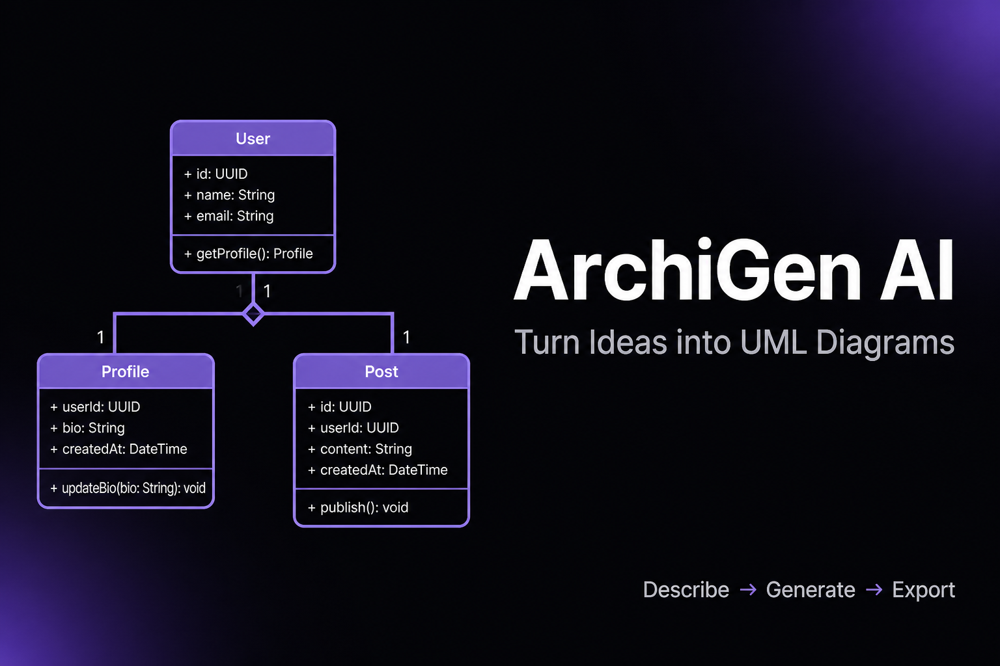

# Arqin AI

<p align="center">
  
</p>

<p align="center">
  <a href="#overview"></a>
  <a href="#overview"></a>
  <a href="#overview"></a>
  <a href="#overview"></a>
</p>

A premium AI-powered architecture studio for turning natural-language ideas into structured system designs, technical diagrams, and implementation-ready documentation.

Arqin AI helps teams, founders, and developers move from concept to architecture in minutes by combining AI intelligence with clean visual modeling and iterative refinement.

---

## Overview

Arqin AI is a modern web application built with Next.js that generates architecture artifacts from plain-language prompts. The platform creates Mermaid diagrams and structured technical explanations that can be refined, reviewed, and reused throughout the design process.

It is designed for:

- system design ideation
- architecture visualization
- technical planning and documentation
- design trade-off analysis
- iteration on existing architecture concepts

---

## Highlights

### ✨ Core Features

- AI-generated architecture and system design output from plain-language prompts
- Multiple diagram types, including architecture, flow, component, ER, and sequence views
- Live refinement workflow to adjust generated designs based on user instructions
- Architecture research assistance for patterns, trade-offs, and best practices
- Project history and saved sessions with browser-based persistence
- Reusable templates for common application patterns
- Export-friendly diagrams for documentation, review, and presentation

### 🎯 Why It Stands Out

- Fast concept-to-diagram workflow
- Clean workspace for iterative design
- Built around developer-friendly architecture thinking
- Focused on visual clarity and technical communication

---

## Tech Stack

- Next.js 16
- React 19
- TypeScript
- Tailwind CSS 4
- Mermaid.js
- Vercel AI SDK
- Groq AI
- Lucide React

---

## Project Structure

```text
ase_project/
├── app/
│   ├── api/
│   │   ├── generate/
│   │   └── research/
│   ├── workspace/
│   ├── globals.css
│   ├── layout.tsx
│   └── page.tsx
├── components/
│   ├── landing/
│   ├── ui/
│   └── workspace/
├── lib/
│   ├── ai/
│   ├── analysis/
│   ├── artifacts/
│   ├── graph/
│   ├── intelligence/
│   ├── optimizer/
│   ├── simulator/
│   ├── storage/
│   ├── adaptive.ts
│   ├── export.ts
│   ├── mermaid.ts
│   ├── mermaid-repair.ts
│   ├── rate-limit.ts
│   └── templates.ts
├── public/
├── package.json
├── pnpm-lock.yaml
├── next.config.ts
├── tsconfig.json
├── postcss.config.mjs
├── eslint.config.mjs
├── README.md
└── .env.local
```

---

## Getting Started

### Prerequisites

- Node.js 18 or newer
- pnpm
- Groq API key

### Installation

1. Clone the repository:

```bash
git clone <repository-url>
cd ase_project
```

2. Install project dependencies:

```bash
pnpm install
```

3. Create a local environment file:

```bash
copy .env.example .env.local
```

If `.env.example` does not exist, create `.env.local` manually:

```env
GROQ_API_KEY=your_groq_api_key_here
NEXT_PUBLIC_SITE_URL=http://localhost:3000
```

### Run the app

```bash
pnpm dev
```

Then open the app in your browser:

- http://localhost:3000 — landing page
- http://localhost:3000/workspace — architecture workspace

---

## Configuration

| Variable | Description |
| --- | --- |
| `GROQ_API_KEY` | API key for AI-powered generation and research requests |
| `NEXT_PUBLIC_SITE_URL` | Base URL used for local app metadata and routing |

---

## Core User Flow

1. Open the landing page and start a new architecture session.
2. Describe the system or application idea in natural language.
3. Select the desired diagram or generation mode.
4. Review the generated Mermaid diagram and architecture explanation.
5. Refine the output using follow-up prompts and iteration.
6. Save, revisit, or continue editing within the workspace.

---

## Application Routes

- `/` — landing page
- `/workspace` — main architecture generation workspace
- `/workspace/generate` — generation flow
- `/workspace/history` — saved sessions and project history
- `/workspace/templates` — starter templates
- `/workspace/research` — architecture research assistant
- `/workspace/projects` — project dashboards and saved work
- `/workspace/settings` — preferences and settings

---

## Available Scripts

| Command | Description |
| --- | --- |
| `pnpm dev` | Start the development server |
| `pnpm build` | Build the production app |
| `pnpm start` | Run the production build |
| `pnpm lint` | Run ESLint checks |

---

## Notes

- AI generation may gracefully fall back to a local synthesis flow when no API key is present.
- Project content is stored in the browser using local storage rather than a backend database.
- This project is optimized for rapid architecture ideation and iteration rather than multi-user production authentication or cloud sync.

---

## License

This project is intended for educational, prototype, and internal-use scenarios unless otherwise specified by the repository owner.
